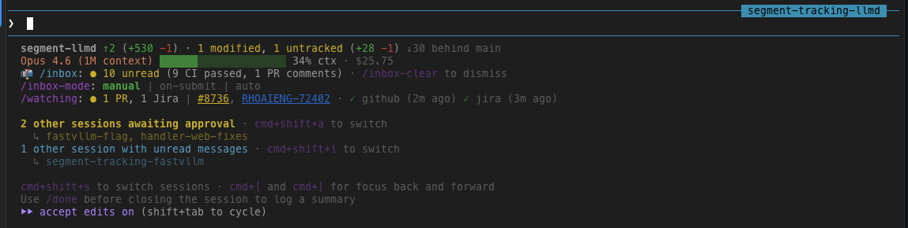

# agent-handler

Manage parallel Claude Code sessions: SQLite event ledger, pub/sub session inboxes, GitHub and Jira resource watchers, statusline enhancements, terminal peeking, cmux integrations and (WIP) web dashboard.



## Install

Requires Go 1.22+ and Claude Code to already be installed.

```bash
git clone https://github.com/mturley/agent-handler.git
cd agent-handler
make build
make install # Copies `handler` binary to /usr/local/bin and runs `handler setup`
```

`handler setup` creates a directory at `~/.agent-handler/`, copies skill and hook files there, and configures Claude Code hooks and skills automatically. It will show you what it does and ask for confirmation before proceeding. If you skip any of its steps (e.g. there are issues authenticating the watchers), run `handler setup` again to retry.

A more convenient install/update script will come soon.

## Update

```bash
cd agent-handler
git pull
make build && make install
```

## Uninstall

```bash
handler uninstall
```

The binary and skill/hook configuration will be cleaned up, but your database and configuration will remain in `~/.agent-handler`. To fully clean up your installation you can delete that directory.

## Key Commands

These are the commands you can use directly from your terminal:

```bash
handler status          # Show all sessions with liveness and unread counts
handler log --global    # Cross-session event timeline
handler triage          # What needs attention across all sessions
handler tail            # Live event stream
handler cost            # API cost breakdown (today/month/per-session)
handler switch          # Interactive session switcher (cmux)
handler switch -a       # Jump to first session awaiting approval (cmux)
handler claude          # Start a peekable Claude session
handler watching        # Show watched resources and watcher status
handler health          # Database health and statistics
handler cleanup         # Archive dead sessions
handler query "SQL"     # Run ad-hoc read-only SQL
```

There are also commands used by hooks and skills (`emit`, `peek`, `register`, `unread`, `statusline`, etc.) that you won't need to run directly. Run `handler --help` for the full list.

## How It Works

Sessions auto-register on their first prompt — you don't need to do anything. The UserPromptSubmit hook detects new sessions and registers them with the current git repo, branch, and terminal environment.

Once registered, sessions emit events to a central SQLite ledger as they work. The global rules file (`~/.claude/rules/agent-handler.md`) teaches each session what events to emit and when — milestones, decisions, blockers, status check-ins. Other sessions and the handler can see these events, enabling cross-session awareness.

### Hooks

Hooks wire Claude Code session lifecycle events to handler:
- **UserPromptSubmit** — registers sessions on first prompt, heartbeat, event injection based on inbox mode, auto-catchup summary on user return
- **SessionEnd** — archives the session and soft-deletes subscriptions
- **Statusline** — heartbeat, session metadata sync, unread notifications, awaiting-approval scan
- **PreCompact** — snapshots context before compaction

### Slash commands

These are available as `/slash-commands` in any Claude session:
- `/inbox` — check and act on unread events
- `/inbox-clear` — dismiss unread events without reading them
- `/inbox-mode` — configure manual, on-submit, or auto delivery
- `/watch` / `/unwatch` — subscribe to PRs and Jira issues
- `/watching` — show watched resources and watcher status
- `/message` — send messages to other sessions
- `/done` — log a completion summary before closing a session
- `/handler` — turn a session into a command center for all sessions
- `/handler-debug` — debug session identity and inbox state

## Inbox Modes

Each session has an inbox mode that controls how it receives events from other sessions and watchers:

| Mode | Behavior |
|------|----------|
| **manual** (default) | The statusline shows an unread count. The agent checks with `/inbox` when you ask. |
| **on-submit** | The UserPromptSubmit hook notifies the agent of unread messages on every prompt, so it checks `/inbox` automatically before responding. |
| **auto** | A cron job polls for new events every minute and invokes `/inbox --auto` in the background. When you return after being away, the agent summarizes what happened while you were gone. |

Use `/inbox-mode manual`, `/inbox-mode on-submit`, or `/inbox-mode auto` to switch. Auto mode sets up a session-scoped cron job that does not survive session restarts — inbox mode resets to manual when the session ends.

## Handler Session

Use `/handler` in a Claude session to turn it into a command center for managing all active sessions. The handler session delivers a prioritized briefing combining triage data, terminal peek results, and a timeline of recent events. It gets a custom statusline showing active/blocked session counts, global event status, and aggregate API cost.

## External Watchers

Watch for external events (PR reviews, Jira comments, CI status) and deliver them to your sessions. Watchers cache current resource state (PR review status, Jira priority, blocked status) for use in triage.

### Setup

```bash
handler watcher install      # Configure tokens + install all authenticated watchers
```

Or step by step:
```bash
handler watcher auth         # Configure API tokens (GitHub, Jira)
handler watcher install github
handler watcher install jira
```

`handler watcher install` creates a scheduled job that runs `handler watcher run <service>` periodically. On macOS this creates a launchd plist; on Linux it adds a cron entry. Both poll at a configurable interval (default: every 2 minutes).

Alternatively, you can skip `handler watcher install` and schedule the watcher runs yourself with cron or any other scheduler:
```bash
# Example crontab entries (every 2 minutes)
*/2 * * * * /usr/local/bin/handler watcher run github
*/2 * * * * /usr/local/bin/handler watcher run jira
```

### Jira custom fields

Jira custom fields let the watcher fetch additional data (epic links, blocked status, story points, etc.) when polling issues. This data is cached in the resource state and available to `handler triage` for richer context. Configure them in `~/.agent-handler/config.yaml`:

```yaml
services:
  jira:
    custom_fields:
      blocked: customfield_10517        # Blocked flag
      blocked_reason: customfield_10483 # Blocked reason (rich text)
      epic_key: customfield_10014       # Epic link
      flagged: customfield_10021        # Impediment flag
      story_points: customfield_10028   # Story points estimate
      git_pull_request: customfield_10875 # Linked PR
```

Default custom fields are added automatically during `handler watcher auth`. The field IDs above are common for Jira Cloud but may differ for your instance — check your Jira admin or use the Jira REST API to find the right IDs.

### Management

```bash
handler watcher list         # Show installed watchers and status
handler watcher stop         # Pause all watchers (or: handler watcher stop github)
handler watcher start        # Resume paused watchers (or: handler watcher start github)
handler watcher logs github  # View watcher logs
handler watcher run github   # Run once manually
handler watcher uninstall    # Remove all watchers (or: handler watcher uninstall github)
```

## cmux Integration

When running inside [cmux](https://cmux.dev), agent-handler integrates deeply with the terminal environment:

- **Session switching** — `handler switch` navigates to any session's cmux workspace and surface tab, with an interactive mode featuring readline tab completion
- **Keyboard shortcuts** — `handler setup` configures cmux actions for quick session switching:
  - `cmd+shift+a` — jump to the first session awaiting approval
  - `cmd+shift+s` — interactive session switcher
- **Workspace tracking** — sessions store their cmux workspace ID, name, and color; `handler status` groups sessions by repo and workspace with colored indicators
- **Awaiting approval detection** — the statusline scans other sessions for approval prompts and shows the keyboard shortcut to jump to them
- **Terminal notifications** — flash and notify via cmux's native notification system when new events arrive

All cmux features degrade gracefully outside cmux — the statusline adapts, keyboard shortcuts don't render, and `handler switch` exits with a clear error.

## Session Inspection (Peek)

Inspect live Claude sessions from other sessions or the handler. Supports cmux (primary) and tmux (fallback) terminal environments.

```bash
handler claude                     # Start a peekable Claude session
handler peek --session <id>        # Capture terminal content
handler status                     # Shows 👁 indicator for peekable sessions
```

Sessions started via `handler claude` or in cmux are automatically peekable. The handler session uses peek via subagents to detect sessions waiting for input.

## Cost Tracking

Track Claude API spend across all sessions with daily rollups and reset detection.

```bash
handler cost                    # Summary header + current month breakdown
handler cost --today            # Today's spend by session
handler cost --month 2026-06    # Specific month breakdown
handler cost --session <id>     # Single session detail (true cost, adjustments, model)
handler cost --json             # Machine-readable output
```

Cost data is captured automatically from the statusline hook (every ~10s) — no manual action needed. This is especially useful in environments like Vertex AI where Anthropic's billing dashboard and Admin API are unavailable. The summary header shows today, this month, last month, and all time:

```
Today: $48.23 | This month: $342.17 | June: $280.44 | All time: $622.61
```

**Reset detection:** Claude Code's in-memory cost counter resets when a laptop restarts and a session resumes. handler detects this (new value lower than last snapshot) and records a cost adjustment, preserving the true lifetime total for each session.

**Statusline integration:** Every session's model line shows its true session cost plus today's spend:
```
Opus 4.6 (1M context) ▓▓▓░░░░░░░░░░░░░░░░░ 18% ctx | $39.07 ($18.42 today)
```

The handler session additionally shows aggregate cost across all sessions:
```
Cost (all sessions): $48.23 today · $342.17 this month · $280.44 Jun
```

## Design

See [docs/superpowers/specs/2026-06-15-agent-handler-design.md](docs/superpowers/specs/2026-06-15-agent-handler-design.md) for the original design spec. A lot has changed since that design, and I've preserved [superpowers](https://claude.com/plugins/superpowers) specs from features I've implemented if you want to explore the evolution of this tool.
