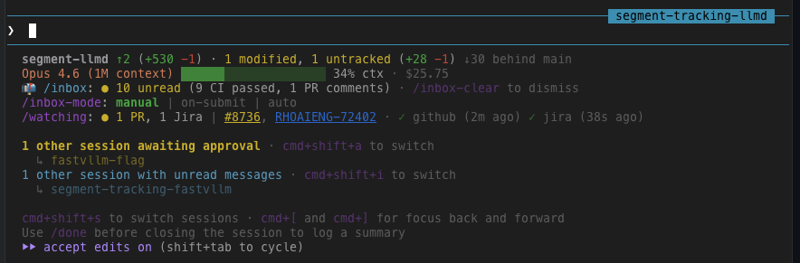
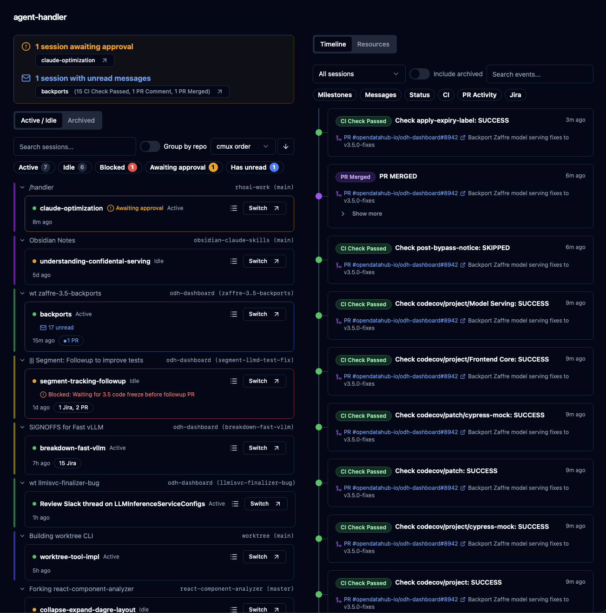

#  agent-handler

Manage parallel Claude Code sessions: SQLite event ledger, pub/sub session inboxes, [GitHub, Jira, and Slack resource watchers](#external-watchers), statusline enhancements, [terminal peeking](#session-inspection-peek), [cmux integrations](#cmux-integration) and [web dashboard](#web-ui).



## Install

Requires Go 1.25+ and Claude Code to already be installed.

```bash
git clone https://github.com/mturley/agent-handler.git
cd agent-handler
make install # Builds, copies `handler` binary to /usr/local/bin, and runs `handler setup`
```

`handler setup` creates a directory at `~/.agent-handler/`, copies skill and hook files there, and configures Claude Code hooks and skills automatically. It will show you what it does and ask for confirmation before proceeding. If you skip any of its steps (e.g. there are issues authenticating the watchers), run `handler setup` again to retry.

### Agent View compatibility

agent-handler does not currently work well with Claude Code's built-in Agent View. When a session is backgrounded by Agent View, it creates a duplicate session entry in handler and triggers a warning. For now, disable Agent View:

- In your Claude Code settings, set `disableAgentView` to `true`, or
- Set the environment variable `CLAUDE_CODE_DISABLE_AGENT_VIEW=true`

A more convenient install/update script will come soon.

## Update

```bash
cd agent-handler
git pull
make install
```

### Migrating an existing database to the watcher library

The watcher subsystem was extracted into the [`mturley/watcher`](https://github.com/mturley/watcher) library, which stores its data in `watcher_*` tables. If you have an existing install with watcher data (subscriptions, cached resource state, PR/Jira events), that data must be migrated once:

```bash
handler watcher stop            # stop the watchers first
handler setup --migrate-watcher # backs up the DB, copies data into the watcher_* tables
handler watcher start
```

Until you migrate, `handler setup` will refuse to run against a pre-migration database and tell you to run the migration (or delete your database and start fresh). The migration is a **one-way structural cleanup**: it auto-backs-up your database to `~/.agent-handler/handler.db.backup-<timestamp>`, copies the legacy data into the `watcher_*` tables, **drops the legacy tables**, and **purges** the now-duplicated github/jira rows from the legacy `events` table. It no longer retains the old tables — the backup is the rollback mechanism. If you already ran an older (Phase 2b) version of this migration that copied data but kept the old tables, running `--migrate-watcher` again finishes the cleanup (no data is re-copied). See [docs/watcher-migration-runbook.md](docs/watcher-migration-runbook.md) for the full procedure, the 2b-adopter finish path, and rollback steps. Watcher credentials in `~/.agent-handler/config.yaml` are copied to `~/.config/watcher/auth.yaml` as part of the migration.

## Uninstall

```bash
handler uninstall
```

The binary and skill/hook configuration will be cleaned up, but your database and configuration will remain in `~/.agent-handler`. To fully clean up your installation you can delete that directory.

## Usage

Most features work immediately in new and existing Claude Code sessions — the hooks and rules file are loaded automatically after `handler setup`, so sessions will start registering, emitting events, and showing the statusline right away.

The optional [web UI](#web-ui) provides a visual dashboard and needs to be started separately:

```bash
handler ui
```

Run this from within [cmux](https://cmux.dev) if you want cmux-specific features like session switching. The UI is available at http://localhost:8420.

For development with hot reload:

```bash
make dev    # requires mprocs; uses air for Go auto-reload if installed
```

This starts both the Go API server and the Vite dev server. Use the UI at http://localhost:5173.

## Key Commands

These are the commands you can use directly from your terminal:

```bash
handler status          # Show all sessions with liveness and unread counts
handler log --global    # Cross-session event timeline
handler triage          # What needs attention across all sessions
handler tail            # Live event stream
handler cost            # API cost breakdown (today/month/per-session)
handler switch          # Interactive session switcher (cmux)
handler switch -a       # Jump to first session awaiting approval (cmux)
handler claude          # Start a peekable Claude session
handler watching        # Show watched resources and watcher status
handler health          # Database health and statistics
handler cleanup         # Archive dead sessions
handler crons           # Cron jobs tracked for this session (--all for every session)
handler query "SQL"     # Run ad-hoc read-only SQL
```

There are also commands used by hooks and skills (`emit`, `peek`, `register`, `unread`, `statusline`, etc.) that you won't need to run directly. Run `handler --help` for the full list.

## How It Works

Sessions auto-register on their first prompt — you don't need to do anything. The UserPromptSubmit hook detects new sessions and registers them with the current git repo, branch, and terminal environment.

Once registered, sessions emit events to a central SQLite ledger as they work. The global rules file (`~/.claude/rules/agent-handler.md`) teaches each session what events to emit and when — status updates, blockers, messages. Other sessions and the handler can see these events, enabling cross-session awareness.

### Hooks

Hooks wire Claude Code session lifecycle events to handler:
- **UserPromptSubmit** — registers sessions on first prompt, heartbeat, event injection based on inbox mode, auto-catchup summary on user return
- **SessionEnd** — archives the session and soft-deletes subscriptions
- **Statusline** — heartbeat, session metadata sync, unread notifications, awaiting-approval scan, rate-limit tracking
- **PreCompact** — snapshots context before compaction
- **Stop** — marks the session idle, reconciles tracked cron jobs, cancels a spent wake job
- **PostToolUse** — records `CronCreate`/`CronDelete`, and checks rate-limit usage mid-task
- **PreToolUse** — auto-approves agent-handler's own wake job, and nothing else
- **StopFailure** — records turns that ended on a rate limit

### Slash commands

These are available as `/slash-commands` in any Claude session:
- `/inbox` — check and act on unread events
- `/inbox-clear` — dismiss unread events without reading them
- `/inbox-mode` — configure manual, on-submit, or auto delivery
- `/catchup` — in auto-inbox mode, summarize auto-delivered events since the last `/catchup`
- `/watch` / `/unwatch` — subscribe to PRs, Jira issues, and Slack threads (when in a worktree, `/watch` also propagates to the `worktree` CLI; see [worktree integration](#worktree-integration))
- `/watching` — show watched resources and watcher status
- `/message` — send messages to other sessions
- `/reminder` — set a reminder that appears in your inbox on the next check (snoozable)
- `/block` / `/unblock` — mark session as blocked or unblocked (shown in statusline)
- `/done` — log a completion summary before closing a session
- `/handler` — turn a session into a command center for all sessions
- `/handler-debug` — debug session identity and inbox state

## Reminders

Use `/reminder check CI on PR #42` to leave yourself a note. Reminders appear in your inbox on the next `/inbox` check, presented separately from other events. When reviewing reminders, you can snooze them — this re-delivers them to your inbox on the next check, so they keep coming back until you're done with them.

## Scheduled Cron Jobs

Claude Code sessions can schedule cron jobs with `CronCreate`. handler tracks them so you can
see what a session has pending — `handler crons`, `handler crons --all`, or the **Cron jobs**
tab on the session detail page.

Tracking combines two signals. A `PostToolUse` hook records jobs as they are created and
deleted, and the `Stop` hook reconciles the table each turn against Claude's own
`session_crons` snapshot. The reconciliation is what makes this accurate: Claude removes jobs
without any tool call — a one-shot auto-deletes the moment it fires, and a recurring job
expires after 7 days — so the create/delete events alone would leave stale rows behind.

These jobs are **in-memory and session-scoped**. They do not survive the session that created
them, and handler tracks them but cannot resurrect them.

## Automatic Rate-Limit Wake Jobs

When a session's 5-hour rate limit usage crosses a threshold (90% by default), handler asks it
to schedule a **wake job**: a one-shot cron job that fires just after the limit resets and
resumes whatever was in progress. The point is unattended work — if you walk away mid-task and
the limit is hit, the session picks itself back up instead of sitting idle until you return.

The scheduling has to happen *early*, because once a session is actually rate-limited it cannot
call `CronCreate` at all. That is why the trigger is a threshold rather than the limit itself,
and why a job is sometimes scheduled for a limit you never reach.

How it fits together:

- The **statusline** hook is the only one that receives `rate_limits`, so it persists the 5h
  window (percentage and reset time) for the other hooks to read.
- **UserPromptSubmit** asks for a wake job before a turn begins; **PostToolUse** covers a long
  turn that crosses the threshold while still running, since `Stop` only fires once a turn is
  over.
- Every check — usage, freshness, threshold, whether a job already exists — happens in the hook.
  The session receives a complete `CronCreate` directive and is never asked to verify anything.
- A **PreToolUse** hook auto-approves that one job, identified by handler's own marker and
  validated against stored state. Every other `CronCreate` follows normal permission rules. No
  entry is added to your `permissions.allow` list.
- **Stop** cancels a spent wake job when the session goes idle, since waking a finished session
  would interrupt one that is waiting on your reply. Only Claude can call `CronDelete`, so Stop
  holds the session open for one turn to do it — guarded against loops, and skipped when the
  turn just died on a rate limit and the job is needed.

Configure in `~/.agent-handler/config.yaml`:

```yaml
auto_wake:
  enabled: true          # default; false disables every path
  threshold_percent: 90  # default
```

Only sessions on the first-party Anthropic API report rate limits. Sessions on Vertex or
Bedrock omit the data entirely, and the feature stays dormant for them.

## Inbox Modes

Each session has an inbox mode that controls how it receives events from other sessions and watchers:

| Mode | Behavior |
|------|----------|
| **manual** (default) | The statusline shows an unread count. The agent checks with `/inbox` when you ask. |
| **on-submit** | The UserPromptSubmit hook notifies the agent of unread messages on every prompt, so it checks `/inbox` automatically before responding. |
| **auto** | A cron job polls for new events every minute and invokes `/inbox --auto` in the background. When you return, use `/catchup` for a summary of what happened. |

Use `/inbox-mode manual`, `/inbox-mode on-submit`, or `/inbox-mode auto` to switch. Auto mode sets up a session-scoped cron job that does not survive session restarts — inbox mode resets to manual when the session ends.

In auto mode, the agent processes events in the background but tracks what you've seen separately (dual cursor). When you send a prompt after being away, the hook detects undelivered events and prompts the agent to invoke `/catchup`, which summarizes everything from the conversation history — including what the agent did in response — and then advances your cursor.

## Handler Session

Use `/handler` in a Claude session to turn it into a command center for managing all active sessions. The handler session delivers a prioritized briefing combining triage data, terminal peek results, and a timeline of recent events. It gets a custom statusline showing active/blocked session counts, global event status, and aggregate API cost.

## External Watchers

Watch for external events (PR reviews, Jira comments, CI status, Slack thread replies) and deliver them to your sessions. Watchers cache current resource state (PR review status, Jira priority, blocked status, Slack thread title/author) for use in triage.

Three services are watched: **GitHub** (PRs), **Jira** (issues), and **Slack** (threads). A new reply to a watched Slack thread becomes an inbox event just like a PR review or Jira comment, and Slack appears alongside GitHub/Jira in `handler watcher list`, `handler watching`, `handler status`, and `handler triage`.

The watcher subsystem — polling, resource state, event storage, and subscription leases — is powered by the reusable [`mturley/watcher`](https://github.com/mturley/watcher) library, which owns its own `watcher_*` tables in handler's SQLite database (`~/.agent-handler/data/handler.db`). handler is one consumer of that library; the credentials and behavior settings it uses live under `~/.config/watcher/` (see below). handler keeps its own scheduling (launchd/cron) and its inbox/session layer on top.

> **Note:** the [`worktree`](https://github.com/mturley/worktree) tool is the library's other consumer, but the two tools do **not** share a database — they share only the library's schema. handler's rows live in `~/.agent-handler/data/handler.db`; worktree's live in a separate file. See [worktree integration](#worktree-integration) for the CLI-level coupling.

### Setup

```bash
handler watcher install      # Test/repair creds + install all authenticated watchers
```

Or step by step:
```bash
handler watcher auth         # Test + repair API credentials (GitHub, Jira, Slack)
handler watcher install github
handler watcher install jira
handler watcher install slack
```

Credentials for all three services live in the shared `~/.config/watcher/auth.yaml`. `handler watcher auth`/`install` run the library's shared **credential test-and-repair** flow (`credsetup`): it validates each service's existing credentials and, if one is missing or invalid, walks you through configuring and re-validating a new one. Non-secret behavior settings (Jira [custom fields](#jira-custom-fields) and bot usernames) live alongside it in `~/.config/watcher/config.yaml`.

`handler watcher install` creates a scheduled job that runs `handler watcher run <service>` periodically. On macOS this creates a launchd plist; on Linux it adds a cron entry. Default poll intervals: GitHub every 3 minutes, Jira and Slack every 5 minutes (override with `--interval`).

Alternatively, you can skip `handler watcher install` and schedule the watcher runs yourself with cron or any other scheduler:
```bash
# Example crontab entries
*/3 * * * * /usr/local/bin/handler watcher run github
*/5 * * * * /usr/local/bin/handler watcher run jira
*/5 * * * * /usr/local/bin/handler watcher run slack
```

### Jira custom fields

Jira custom fields let the watcher fetch additional data (epic links, blocked status, story points, etc.) when polling issues. This data is cached in the resource state and available to `handler triage` for richer context. They are a non-secret behavior setting, owned by the watcher library and configured in `~/.config/watcher/config.yaml` under `jira.custom_fields`:

```yaml
jira:
  custom_fields:
    blocked: customfield_10517        # Blocked flag
    blocked_reason: customfield_10483 # Blocked reason (rich text)
    epic_key: customfield_10014       # Epic link
    flagged: customfield_10021        # Impediment flag
    story_points: customfield_10028   # Story points estimate
    git_pull_request: customfield_10875 # Linked PR
```

Default custom fields are added automatically during `handler watcher auth`. The field IDs above are common for Jira Cloud but may differ for your instance — check your Jira admin or use the Jira REST API to find the right IDs.

### Management

```bash
handler watcher list         # Show installed watchers and status
handler watcher stop         # Pause all watchers (or: handler watcher stop github)
handler watcher start        # Resume paused watchers (or: handler watcher start github)
handler watcher logs github  # View watcher logs
handler watcher run github   # Run once manually
handler watcher uninstall    # Remove all watchers (or: handler watcher uninstall github)
```

### worktree integration

When a session runs inside a [`worktree`](https://github.com/mturley/worktree)-managed worktree and the `worktree` binary is on `PATH`, handler shares resource-watching intent with it — entirely at the **CLI level** (handler shells out to `worktree`; the two tools keep separate databases):

- **On session registration**, handler reads the worktree's *primary* resources via `worktree resources list --json` and auto-watches them for the session (respecting any prior `/unwatch` tombstone). This replaced the older `.worktree-resources` file mechanism.
- **`/watch`** (subscribe) additionally propagates the resource to worktree via `worktree resources add`, so it shows up in worktree's own UI/timeline. It's added as *primary* by default; pass `--related` on `handler subscribe` to add it as a related resource instead.
- **`/unwatch`** is handler-only — it never touches worktree's subscriptions, so one session unwatching a resource doesn't stop worktree (or another session) from watching it.

All of this is best-effort: if `worktree` isn't installed, handler works exactly as before with no error.

## cmux Integration

When running inside [cmux](https://cmux.dev), agent-handler integrates deeply with the terminal environment:

- **Session switching** — `handler switch` navigates to any session's cmux workspace and surface tab, with an interactive mode featuring readline tab completion. Also enhances the [web UI](#web-ui) with session switch buttons.
- **Keyboard shortcuts** — `handler setup` configures cmux actions for quick session switching:
  - `cmd+shift+a` — jump to the first session awaiting approval
  - `cmd+shift+s` — interactive session switcher
- **Workspace tracking** — sessions store their cmux workspace ID, name, and color; `handler status` groups sessions by repo and workspace with colored indicators
- **Awaiting approval detection** — the statusline scans other sessions for approval prompts and shows the keyboard shortcut to jump to them. This is also surfaced in the [web UI](#web-ui).
- **Terminal notifications** — flash and notify via cmux's native notification system when new events arrive

All cmux features degrade gracefully outside cmux — the statusline adapts, keyboard shortcuts don't render, `handler switch` exits with a clear error, and the web UI hides its session switch buttons.

## Session Inspection (Peek)

Inspect live Claude sessions from other sessions or the handler. Supports cmux (primary) and tmux (fallback) terminal environments.

```bash
handler claude                     # Start a peekable Claude session
handler peek --session <id>        # Capture terminal content
handler status                     # Shows 👁 indicator for peekable sessions
```

Sessions started via `handler claude` or in cmux are automatically peekable. The handler session uses peek via subagents to detect sessions waiting for input.

## Cost Tracking

Track Claude API spend across all sessions with daily rollups and reset detection. Cost data is captured automatically from the statusline hook (every ~10s). This is especially useful in environments like Vertex AI where Anthropic's billing dashboard and Admin API are unavailable.

```bash
handler cost                    # Summary header + current month breakdown
handler cost --today            # Today's spend by session
handler cost --month 2026-06    # Specific month breakdown
handler cost --session <id>     # Single session detail (true cost, adjustments, model)
handler cost --json             # Machine-readable output
```

**Reset detection:** Claude Code's in-memory cost counter resets when a laptop restarts and a session resumes. handler detects this (new value lower than last snapshot) and records a cost adjustment, preserving the true lifetime total for each session.

### Experimental: enhanced cost display

> **Note:** Enhanced cost display is experimental. The accuracy of cost figures has not been fully validated — they are derived from Claude Code's own `total_cost_usd` field, which may not match your actual billing. Use `handler cost` output as a rough guide, not as a billing source of truth.

To enable enhanced cost display in the statusline, add this to `~/.agent-handler/config.yaml`:

```yaml
experimental:
  cost_display: true
```

When enabled:
- Every session's model line shows true session cost (with reset adjustments) plus today's spend: `$39.07 ($18.42 today)`
- The handler session shows aggregate cost across all sessions: `Cost (all sessions): $48.23 today · $342.17 this month · $280.44 Jun`

When disabled (the default), the statusline shows the raw cost value from Claude Code without adjustments or daily breakdowns. The `handler cost` CLI command works regardless of this setting.

## Web UI

A web dashboard served by `handler ui`. Built with React, TypeScript, Tailwind CSS, and shadcn/ui. Responsive down to 400px for use in narrow cmux browser panes.



### Sessions Tab

View all active and idle sessions grouped by repo and cmux workspace. Features:
- **Fuzzy search** across session names and branches
- **Filter chips** — Active, Idle, Awaiting approval, Has unread — each showing a count
- **Sort options** — Match cmux tab order (default), Last prompt, Unread count, Name
- **Collapsible grouping** by repo and workspace, with colored workspace bars matching cmux
- **Session cards** with state badges, unread event counts with type breakdowns, a separate reminders count, resource subscription counts, and cmux Switch buttons. Click a card to open its [session detail page](#session-detail-page).
- **Attention summary** — highlights sessions awaiting approval, with unread messages, and with reminders; each entry links to the session's detail page (and can switch cmux to it)

### Session Detail Page

Clicking a session card (or running `handler ui-open` / the `/ui` skill) opens a focused page for one session at `/sessions/{id}`. It shows the session card, that session's inbox inline (expand and dismiss individual events, or dismiss all), and **Timeline**, **Resources**, and **Cron jobs** tabs hard-filtered to the session. The Timeline tab badge shows the time since the last event; the Resources tab badge shows per-type counts; the Cron jobs badge shows how many jobs are scheduled, each listed with its schedule, recurrence, prompt, and next fire time. This view is designed to live in its own cmux browser pane pointed at a single session.

### Timeline Tab

A chronological event feed in a chat-style layout with a vertical timeline, colored type dots, and expandable event bubbles. Features:
- **Infinite scroll** — loads older events as you scroll down
- **Live updates** — new events appear at the top via SSE
- **Full filtering** — by session, event type, source, and free-text search
- **Expandable details** — click events to see full body content
- **External resource links** — PR and Jira events link directly to their URLs
- **Cross-tab navigation** — click a session card's Timeline button to jump to its events, or click a session name on an event to jump back to the Sessions tab

### cmux Integration

When `handler ui` is started from within cmux, session Switch buttons are enabled — clicking one navigates cmux to that session's workspace and surface tab (hovering shows a live terminal peek). Session references outside the session cards (in the attention summary, timeline events, and resource cards) are split buttons: the left side opens the session's detail page, and the right side switches cmux to it. Outside cmux, the switch side is hidden and a warning is shown at startup.

`handler ui-open [name|id]` opens the web UI focused on a session (defaulting to the current session, or the main page if none), reusing an already-running server if one is up; the `/ui` skill wraps it. Both open the page in a cmux browser pane when run inside cmux.

## Design

See [docs/superpowers/specs/2026-06-15-agent-handler-design.md](docs/superpowers/specs/2026-06-15-agent-handler-design.md) for the original design spec. A lot has changed since that design, and I've preserved [superpowers](https://claude.com/plugins/superpowers) specs from features I've implemented if you want to explore the evolution of this tool.
